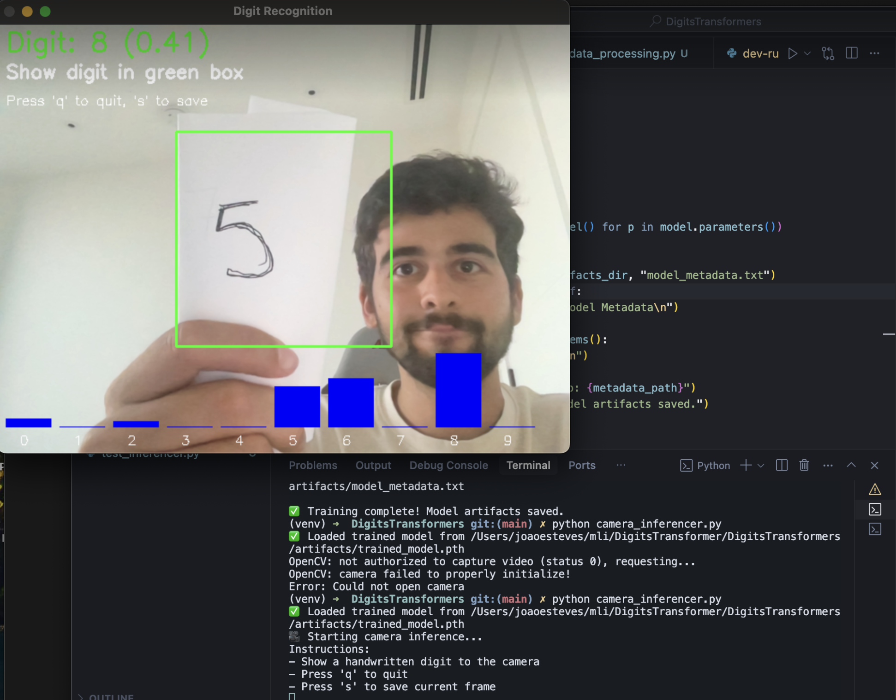

# Digits Transformer

This project is a deep dive into the Vision Transformer (ViT) architecture, implemented from scratch using PyTorch. It's designed to provide a clear and educational journey into how Transformers can be applied to computer vision tasks, specifically for classifying handwritten digits from the MNIST dataset.

The project includes a detailed Jupyter notebook for experimentation and visualization, a modular backend for training and inference, and a real-time camera inference script.

## Features

*   **Vision Transformer from Scratch:** A complete implementation of the ViT architecture, built with clarity and educational purposes in mind.
*   **Modular Backend:** The code is organized into logical modules for data processing, model architecture, training, and analysis.
*   **Detailed Jupyter Notebook:** `model_draft.ipynb` provides a step-by-step guide through the model's development, with rich visualizations and explanations.
*   **Real-time Camera Inference:** Use your webcam to recognize handwritten digits in real-time.
*   **Training and Analysis Tools:** Scripts to train the model from scratch and analyze its performance.

## Installation

1.  **Clone the repository:**
    ```bash
    git clone https://github.com/your-username/DigitsTransformers.git
    cd DigitsTransformers
    ```

2.  **Create a virtual environment (recommended):**
    ```bash
    python -m venv venv
    source venv/bin/activate  # On Windows, use `venv\Scripts\activate`
    ```

3.  **Install the dependencies:**
    ```bash
    pip install -r requirements.txt
    ```

## Usage

### Training the Model

To train the Vision Transformer model, you can run the main script in the `backend` directory:

```bash
python backend/main.py --train
```

This will train the model on the MNIST dataset and save the trained weights to the `artifacts` directory.

### Real-time Camera Inference

Once the model is trained, you can use the camera inference script to recognize digits in real-time.

```bash
python backend/camera_inferencer.py
```

This will open a window with your webcam feed. Draw a digit in the center of the screen and the model will predict what it is.

### Jupyter Notebook

For a detailed walkthrough of the model and its development, open the `model_draft.ipynb` notebook:

```bash
jupyter notebook model_draft.ipynb
```

## Project Structure

```
.
├── artifacts/              # Trained model weights
├── backend/                # Core project source code
│   ├── analysis_tools.py
│   ├── camera_inferencer.py # Real-time inference
│   ├── data_processing.py
│   ├── main.py              # Main training script
│   ├── __pycache__/
│   ├── training_engine.py
│   └── transformer_architecture.py # ViT model
├── model_draft.ipynb       # Jupyter notebook for experimentation
├── requirements.txt        # Project dependencies
└── README.md
```

## Live Demo

Here's the model in action, trying to recognize a handwritten digit from a webcam feed:



## Limitations and Future Work

The model was trained on the MNIST dataset, which consists of pre-processed images of black digits on a white background (the inverse of what is shown in the live demo). As a result, its performance on real-world, unprocessed images is limited. The model struggles when the digit is not centered, properly scaled, or has a different color scheme.

The next step for this line of work is a separate project that will implement a full encoder-decoder architecture. The goal is to create a model that can take a live camera feed, automatically detect and crop the digit, and pre-process it to resemble the MNIST data format before feeding it to the classification model. This will significantly improve its real-world usability.
